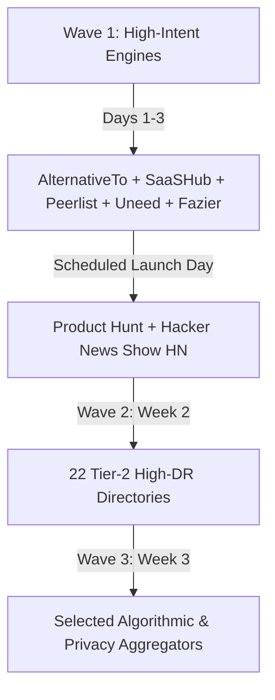

# Directory Launch Strategy & Platform Matrix (94 Platforms)

A rigorous, market-researched evaluation of 94 startup directories, launchpads, and product indexing platforms for **Compresso** (iOS On-Device Media Cleaner & Compressor).

---

## 1. Executive Summary & Strategic Realism

Submitting an app to 94 directories can easily consume 40+ hours. Without a structured filtering model, 70% of that effort is wasted on dead link farms, enterprise B2B review portals (where consumer iOS apps do not convert), or paid AI aggregator cash-grabs.

### Key Strategic Realities for Compresso:
1. **The Intent Rule (Direct Downloads vs SEO Backlinks)**:
   - Only **5–8 platforms** in this list will ever drive direct, high-intent consumer app installs (primarily **AlternativeTo**, **Product Hunt**, **Hacker News**, and **SaaSHub**).
   - Another **25–30 platforms** provide high-authority dofollow/nofollow backlinks (DR 70+) that build domain rating and organic search visibility for Compresso's web presence.
   - The remaining ~55 are either niche AI aggregators, B2B SaaS review platforms, or low-tier clones.
2. **The "Zero Paid Submission" Law**:
   - Many of these directories introduce paywalls ($19 to $99 for "Featured" or "Skip the Queue").
   - **Never pay for directory submissions for Compresso.** Paid directory CAC exceeds $25 per click with near-zero conversion to iOS subscription. Free tiers only.
3. **Consumer iOS vs SaaS Disconnect**:
   - Compresso is a **consumer iOS mobile utility (B2C)** with on-device hardware acceleration, privacy, and freemium subscription. It is **not** a B2B SaaS, not an API, not an open-source library, and not a ChatGPT/Midjourney wrapper.

---

## 2. The 4-Tier Strategic Classification

```
┌────────────────────────────────────────────────────────────────────────┐
│ TIER 1: CORE VALUE ENGINES (10 Platforms)                              │
│ High intent, direct consumer downloads, community engagement.          │
│ Action: Manual, deeply tailored submissions + launch day focus.        │
├────────────────────────────────────────────────────────────────────────┤
│ TIER 2: HIGH-AUTHORITY BACKLINK BUILDERS (22 Platforms)                │
│ DR 70+, software/startup general directories.                          │
│ Action: Standardized copy-paste submission for SEO domain rating.      │
├────────────────────────────────────────────────────────────────────────┤
│ TIER 3: ALGORITHMIC / AI DIRECTORIES (25 Platforms)                    │
│ Requires repositioning: "Smart On-Device Perceptual Compression".      │
│ Action: Submit only if 100% free and accepts visual utilities.         │
├────────────────────────────────────────────────────────────────────────┤
│ TIER 4: MISALIGNED OR LOW-VALUE (37 Platforms)                         │
│ B2B SaaS, developer APIs, agency lists, low-DR (<45) link farms.       │
│ Action: SKIP or lowest priority — do not waste time.                   │
└────────────────────────────────────────────────────────────────────────┘
```

---

## 3. Tier 1: Core Value Engines (Top 10 — Must Execute)

These platforms provide legitimate user acquisition, community buzz, or high-intent competitor comparison.

| # | Platform | DR | Compresso Fit | Why It Matters & Actionable Strategy |
|---|---|---|---|---|
| 1 | **AlternativeTo** | 80 | **Critical (P0)** | **Highest conversion channel on the web.** Users explicitly search: *"Alternative to CleanMyPhone"*, *"Alternative to Gemini Photos"*, *"Free video compressor for iPhone"*. Create profile, list Compresso as an alternative to CleanMyPhone, Smart Cleaner, and Google Photos. Emphasize: *100% on-device, zero cloud, private, one-time/monthly*. |
| 2 | **Product Hunt** | 91 | **P0 (Dedicated Day)** | Gold standard tech launchpad. Requires scheduled Tuesday–Thursday 00:01 PST push. Do not mix with Reddit day. Pre-package 5 media assets, maker first comment, and mobilize existing community for Product of the Day. |
| 3 | **Hacker News (Show HN)** | 91 | **P0 (Technical Focus)** | Deeply technical and privacy-conscious audience. Do not market as a "cleaner app" (seen as scammy). Pitch as: *"Show HN: Compresso – Swift 6, hardware-accelerated on-device media compressor for iOS, zero cloud"*. Highlight VideoToolbox, Metal, Laplacian sharpness detection, zero analytics on photos. |
| 4 | **SaaSHub** | 80 | **P1 (High Intent)** | Ranks high on Google for competitor comparisons. Automatically creates "Compresso vs CleanMyPhone" comparison pages. Add full pricing and feature specs. |
| 5 | **BetaList** | 76 | **P1 (Early Adopters)** | Great for polished consumer mobile apps. Thousands of early tech enthusiasts browse for sleek iOS utilities. Submit for free queue. |
| 6 | **Indie Hackers** | 81 | **P1 (Community Backlink)** | Create a Product Page + Milestone Post: *"Building an offline iOS video compressor with Swift 6"*. Indie hackers love bootstrapped iOS success stories and give valuable UX critiques. |
| 7 | **Peerlist** | 77 | **P1 (Design & Tech)** | Highly active community of designers and developers. Focus on UI craftsmanship: *"Split-screen comparison slider, fluid card swiping, dark mode aesthetics"*. Launch in Peerlist Project Spotlight. |
| 8 | **Uneed** | 75 | **P1 (Curated Tools)** | One of the highest quality modern curated tool directories. Has a daily upvote leaderboard with real tech early adopters. Free submission available. |
| 9 | **Fazier** | 83 | **P1 (Product Hunt Alt)** | Very active alternative launch platform with daily awards and strong domain authority (DR 83). High backlink value. |
| 10 | **Microlaunch** | 64 | **P1 (Indie Launchpad)** | Rapidly growing indie launch platform with daily and monthly voting. Great community engagement for solo developers. |

---

## 4. Tier 2: High-Authority Backlink Builders (DR 70+ Startup Directories)

These sites rarely produce direct paying mobile subscribers, but their high Domain Rating passes significant SEO authority to Compresso's App Store and landing pages, helping Google index Compresso for external web searches.

| # | Platform | DR | Strategy & Recommendation |
|---|---|---|---|
| 11 | **Startup Fame** | 83 | DR 83. Great backlink. Submit standard 100-word startup blurb and screenshot. |
| 12 | **Findly Tools** | 81 | DR 81. Curated tool discovery platform. Free standard submission. |
| 13 | **Smol Launch** | 74 | DR 74. Clean micro-launchpad. Submit via free tier for a daily spotlight. |
| 14 | **LaunchIgniter** | 74 | DR 74. Startup launch aggregator. Quick 5-minute submit. |
| 15 | **StartupBase** | 73 | DR 73. Early-stage product community. Submit with maker profile. |
| 16 | **Tiny Launch** | 73 | DR 73. Lightweight directory for indie apps. High DR backlink. |
| 17 | **Aura++** | 73 | DR 73. Directory of modern web and mobile utilities. |
| 18 | **Software World** | 73 | DR 73. Software directory. Add under "Mobile Utilities / Multimedia". |
| 19 | **Neeed Directory** | 73 | DR 73. Design-centric tool directory. High aesthetic bar (Compresso fits well). |
| 20 | **Startup Fast** | 72 | DR 72. Startup index. Standard submission. |
| 21 | **Open Launch** | 72 | DR 72. Open submission launchpad. |
| 22 | **FoundrList** | 72 | DR 72. Directory curated for founders and creators. |
| 23 | **StartupBlink** | 72 | DR 72. Global startup ecosystem directory. Register app under Kyiv/Ukraine ecosystem. |
| 24 | **TrustMRR** | 71 | DR 71. Focused on bootstrapped revenue projects. Great credibility if sharing metrics. |
| 25 | **Tiny Startups** | 71 | DR 71. Directory of indie, bootstrapped apps. Free submission. |
| 26 | **SideProjectors** | 71 | DR 71. Community for side projects. Good for indie maker backlinks. |
| 27 | **OpenHunts** | 71 | DR 71. Product Hunt-style directory. Quick submit. |
| 28 | **Scroll Launch** | 70 | DR 70. Modern launch feed. Submit via web form. |
| 29 | **ToolFame** | 75 | DR 75. High authority tool directory. |
| 30 | **PeerPush** | 75 | DR 75. Community directory and upvoting site. |
| 31 | **PitchWall** | 69 | DR 69. Startup pitch wall. Submit clean visual cards. |
| 32 | **Startup Stash** | 65 | DR 65. Long-standing directory for tools. List under Photo/Video resources. |

---

## 5. Tier 3: AI & Algorithmic Aggregators (Positioning Required)

**Warning**: Compresso is **not** a generative AI tool. If submitted as a generic app, these directories will reject it. However, because many have DR 65–85, Compresso can be legitimately positioned around **"Algorithmic Quality-Preserving Visual Compression & On-Device Vision Processing"** (Laplacian edge preservation, smart bit-rate adaptation).

| # | Platform | DR | Repositioning Strategy |
|---|---|---|---|
| 33 | **There's an AI for That** | 77 | DR 77. Massive traffic. Tag: *AI Photo Compression / Media Optimization*. Highlight smart edge detection. |
| 34 | **Toolify** | 73 | DR 73. Huge directory. Submit under *Image Processing / Video Tools*. Free queue only. |
| 35 | **Futurepedia** | 72 | DR 72. High traffic. Focus on smart algorithmic storage optimization. |
| 36 | **Future Tools** | 69 | DR 69. Curated by Matt Wolfe. Requires clean utility pitch. Skip if paid. |
| 37 | **Dang AI** | 82 | DR 82. High authority backlink. Submit free if available. |
| 38 | **Twelve Tools** | 82 | DR 82. Powerful backlink. Standard tool submission. |
| 39 | **Turbo0** | 80 | DR 80. AI & smart tool search engine. |
| 40 | **Tool Pilot** | 78 | DR 78. Curated tool database. |
| 41 | **Show Me Best AI** | 76 | DR 76. Submit under Media Tools. |
| 42 | **Open Tools** | 69 | DR 69. Open AI & software directory. |
| 43 | **NxGn Tools** | 69 | DR 69. Next-gen tool directory. |
| 44 | **Versily** | 68 | DR 68. AI and automated tools index. |
| 45 | **AI Tools (aitools.inc)**| 67 | DR 67. Standard algorithmic media utility submission. |
| 46 | **UNO Directory** | 66 | DR 66. General & smart tech directory. |
| 47 | **Top AI Tools** | 64 | DR 64. Media compression category. |
| 48 | **Huzzler** | 64 | DR 64. Tech tools directory. |
| 49 | **Dev Hunt** | 63 | DR 63. Developer-focused product hunt. Pitch the Swift 6 architecture. |
| 50 | **Startup Ranking** | 61 | DR 61. Global ranking index. |
| 51 | **AIxploria** | 56 | DR 56. French/international AI directory. |
| 52 | **AI Tool Directory** | 52 | DR 52. Directory backlink. |
| 53 | **Euro Alternative** | 38 | DR 38. **Strategic Niche**: Position as the *European Privacy Alternative* to US cloud photo hoarders. 100% on-device, GDPR compliant. |

---

## 6. Tier 4: Misaligned or Low-Value Platforms (SKIP or Deprioritize)

These platforms either have zero relevance to an iOS consumer utility, represent B2B enterprise SaaS marketplaces, or have very low authority (DR < 45) with negligible organic traffic.

### A. Completely Misaligned (Do Not Submit)
- **Clutch (DR 91)**: Exclusively for B2B digital agencies, dev shops, and enterprise consultants. An iOS app listing is invalid and rejected.
- **Public APIs (DR 46)**: For public developer APIs and endpoints. Compresso is a local mobile client with no public API.
- **GetApp (DR 85)** & **Software Suggest (DR 77)** & **SaaS Genius (DR 57)**: Gartner-owned or B2B enterprise software review sites (CRMs, ERPs, HR software). Waste of time for a $2.99 consumer iOS compression tool.
- **SourceForge (DR 92)**: Desktop/server open-source software. Mobile iOS consumer apps look completely out of place.
- **OpenAlternative (DR 52)**: Exclusively for open-source alternatives. Compresso is proprietary.
- **AI for Developers (DR 21)** & **Dev Resources (DR 40)**: For developer SDKs and code tools.

### B. Low Authority / Low Traffic Link Farms (Submit only if automated/free)
- **SEO Wins (DR 32)**, **Startup Buffer (DR 43)**, **Toolfolio (DR 35)**, **TinyHunt (DR 43)**, **Altern (DR 49)**, **Resource FYI (DR 31)**, **AI Valley (DR 33)**, **AI Tools Club (DR 35)**, **AI Parabellum (DR 34)**, **MakerHunt (DR 45)**, **SideHunt (DR 44)**, **Firsto (DR 56)**, **Daily Pings (DR 56)**, **Micro SaaS Examples (DR 49)**, **Build Voyage (DR 43)**, **Product Burst (DR 40)**, **Try Launch (DR 56)**, **Find Your SaaS (DR 44)**, **SaaS Hunt (DR 60)**, **Startup Listing (DR 40)**, **Promote Project (DR 50)**, **Idea Kiln (DR 51)**, **IndieHub (DR 40)**, **Appscribed (DR 41)**, **SEOFAI (DR 19)**, **Powerusers AI (DR 33)**, **ShipBoost (DR 50)**, **Launch Vault (DR 56)**.

---

## 7. Submission Master Copy & Assets Kit

To execute Tier 1 & Tier 2 submissions in under 2 hours without context switching, use these standardized copy templates:

### 1. Elevator Pitch (Under 60 chars)
> Compresso — Shrink iPhone videos & photos by up to 80%

### 2. Short Description (Under 150 chars)
> Fast, 100% on-device photo and video compressor for iOS. Free up gigabytes of iPhone storage without losing visual quality or uploading to the cloud.

### 3. Key Differentiators / Bullets
- **100% On-Device Privacy**: Zero cloud uploads. All video and photo processing runs natively using Apple Silicon hardware acceleration.
- **Lossless Visual Fidelity**: Intelligent Laplacian edge preservation and perceptual compression — shrinks 4K video from 1 GB to 150 MB with no visible degradation.
- **Side-by-Side Comparison Slider**: Inspect full-resolution frames before and after compression in real time.
- **Tinder-Style Review Flow**: Clean up forgotten media with quick, effortless left/right swipe gestures.
- **Privacy First**: No account required, zero tracking, works 100% offline (Airplane mode compatible).

### 4. Primary Categories & Tags
- Categories: `iOS Utilities`, `Mobile Photography`, `Photo & Video`, `Productivity`, `Storage Cleaner`
- Tags: `ios`, `iphone`, `compression`, `video-compression`, `photo-cleaner`, `storage`, `privacy`, `swift`

### 5. Competitor Mapping (For AlternativeTo / SaaSHub)
- **Alternative to**: CleanMyPhone, Gemini Photos, Smart Cleaner, Google Photos, HandBrake.

---

## 8. Execution Timeline & Batching Plan

Do not attempt all 94 at once. Execute in 3 distinct, manageable waves:



1. **Wave 1 (High Intent — Days 1–3)**:
   - Setup profile on **AlternativeTo** (immediately generates organic search traffic).
   - Setup **SaaSHub**, **Peerlist**, **Uneed**, and **Fazier**.
2. **Dedicated Launch Day**:
   - Execute **Product Hunt** (full day commitment) and **Hacker News (Show HN)**.
3. **Wave 2 (SEO Authority — Week 2)**:
   - Batch-submit to the 22 Tier-2 directories with DR 70+ using the Copy Kit above (approx. 10 minutes per 3 directories).
4. **Wave 3 (Niche / Privacy — Week 3)**:
   - Submit to European/Privacy directories (**Euro Alternative**) and select algorithmic tool directories. Skip Tier 4 entirely.
